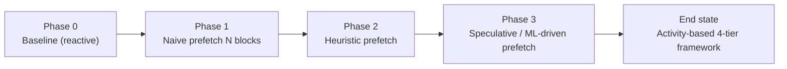

# Activity-Based KV Cache Tier Placement — Experiment Definition

## Scope

This document defines the ABC (Activity-Based KV cache tier placement) research project: the problem, the proposed end-state framework, and the phased experimental path used to reach it. It is the canonical reference for what each phase is trying to prove, what evidence is required to exit a phase, and how the phases connect.

The ABC project evolves the vLLM KV offload engine from reactive, demand-driven block fetching toward predictive, speculative prefetching. The end state is an activity-based KV cache management framework that proactively places KV cache blocks across a four-tier storage hierarchy.

> **Repo investigation scope.** This definition deliberately does not depend on a current vLLM code audit. Implementation-placement notes already recorded in [[Activity-Based KV Cache Offloading]] (session `ses_03d89d8f2ffezttCL70TiLlrIv`, 2026-08-02) are referenced where relevant but are not re-derived here.

## Problem statement

Existing KV cache management systems, including vLLM, LMCache, and Mooncake, primarily rely on reactive eviction and heuristic-based migration policies to manage KV cache data placement across storage tiers. Our KV cache offloading benchmarking indicates that workload access patterns exhibit sufficient locality to enable more effective tier placement decisions. We propose an activity-based KV cache management framework that proactively places KV cache blocks across GPU, CPU, NVMe, and distributed storage tiers to improve cache reuse and reduce unnecessary data movement.

## Proposed solution

The framework continuously estimates the access temperature of KV cache blocks and dynamically places them across a four-tier storage hierarchy consisting of GPU HBM, CPU DRAM, NVMe SSD, and a parallel file system (e.g., CephFS).

### Temperature prediction

A lightweight XGBoost-based prediction engine estimates the probability that a KV cache block will be accessed within short-, medium-, and long-term time horizons (e.g., 1 minute, 10 minutes, and 1 hour). These prediction windows can be tuned during benchmarking.

Each KV cache block is represented by an N-dimensional feature vector containing:

- **Temporal features:** access frequency, recency, inter-access statistics, block type, token position, and current storage tier.
- **Spatial features:** sequence position, neighboring block activity, and sibling access ratios.
- **Session features:** conversation turn count, reuse ratio, inter-turn intervals, session recency, and session duration.

Combining temporal, spatial, and session-level information enables the framework to identify hot KV cache blocks before they become performance-critical. Temperature information can also be exported to the llm-d endpoint picker to improve session-aware routing decisions.

### Cost-aware tier placement

Predicted temperatures classify KV cache blocks into four storage tiers:

| Temperature | Tier |
|---|---|
| Hot | GPU |
| Warm | CPU |
| Cool | NVMe |
| Cold | CephFS |

Migration decisions are governed by a cost-benefit model that considers transfer cost, GPU opportunity cost, expected latency reduction, and avoided recomputation. A migration is performed only when

$$\text{Benefit} > N \times \text{Cost}$$

where $N$ is a configurable threshold.

A priority scheduler performs asynchronous multi-hop prefetching through intermediate storage tiers, promoting hot blocks before they are needed while minimizing migration overhead.

### Session-aware prefetching

When a conversation is migrated to another inference node, the framework identifies the hottest KV cache blocks, ranks them by predicted temperature, and proactively prefetches them to the destination before the next user turn arrives. This minimizes cache warm-up latency and improves KV cache reuse across multi-turn conversations.

## Phased experiment plan

The end-state framework is reached through four phases. Each phase has a single objective, a defined method, and explicit exit criteria. A phase is only considered complete when its exit criteria are met with documented evidence; phases are intentionally sequential because each later phase depends on the latency/reuse signal validated by the previous one.

The progression is deliberately from "prove prefetching helps at all" to "predict which blocks to prefetch before they are requested":

1. **Phase 0 — Baseline characterization (reactive fetching).** Measure how the system behaves today.
2. **Phase 1 — Naive proactive prefetching (toy).** Prefetch a fixed number $N$ of blocks and check whether latency improves at all.
3. **Phase 2 — Heuristic prefetching.** Replace the fixed-$N$ rule with a developed, rule-based prefetch heuristic.
4. **Phase 3 — Speculative prefetching (end goal).** Replace the heuristic with ML-driven temperature prediction and the full cost-aware placement framework.

### Phase 0 — Baseline characterization (reactive fetching)

**Objective.** Establish the current behavior of the vLLM KV offload engine under reactive, demand-driven block fetching, and quantify the locality that motivates the whole project.

**Method.** Use existing and additional benchmarking runs to characterize:

- Per-tier lookup latency distributions (P50/P90/P99) for CPU, NVMe, and CephFS tiers.
- Blocked-request concurrency and stall rates during reactive fetches.
- KV cache block reuse / recompute balance (external-tier token share vs. local recompute).
- Access locality: how concentrated block accesses are (e.g., empirical CDF of block access frequency), to test the "≈20% of blocks accessed ≈80% of the time" hypothesis from the concept note.

**Inputs.**

- Existing Nemotron no-offload / CPU / CephFS / NVMe runs (see [[2026-08-10 - ABC Nemotron no-offload versus CPU-offload KV lookup report]]).
- Additional runs as needed to expose per-block access telemetry (the current report is request-visible lookup telemetry, not per-block access traces).

**Exit criteria.**

1. A documented baseline of reactive-fetch latency and stall behavior across all available tiers.
2. A quantified locality estimate (access-frequency concentration) sufficient to justify proactive placement.
3. Identified telemetry gaps that must be closed before Phase 1 (e.g., per-block access/reuse counters, overflow buckets for censored P99 values).

**Outputs.**

- Baseline characterization report (dated, under `Research/ABC/`).
- Telemetry-gap list feeding Phase 1.

### Phase 1 — Naive proactive prefetching (toy)

**Objective.** Prove the core premise: proactively prefetching KV blocks before they are requested reduces request-visible latency, before investing in any prediction logic.

**Method.** Implement a minimal proactive prefetcher that, at a fixed trigger, prefetches the top-$N$ most-recently-accessed (or most-frequently-accessed) KV blocks to the destination tier, with $N$ swept over a small set of values. No prediction model, no cost model. Measure whether latency improves versus the Phase 0 baseline.

**Inputs.**

- Phase 0 baseline + telemetry gaps closed.
- A minimal prefetch trigger and a fixed-$N$ block selection rule.

**Exit criteria.**

1. A measurable, repeatable latency change (positive or negative) for at least three values of $N$, reported as mean ± CI with paired-request analysis.
2. A decision recorded: does naive prefetching improve latency enough to justify a heuristic? If yes → Phase 2. If no → document why and revisit assumptions before proceeding.

**Outputs.**

- Toy-prefetch run batch and a short go/no-go decision note.

### Phase 2 — Heuristic prefetching

**Objective.** Replace the fixed-$N$ rule with a developed, rule-based prefetch heuristic and show it outperforms the Phase 1 toy over a wider range of conditions.

**Method.** Build an activity-based heuristic that selects blocks to prefetch using hand-tuned rules over the temporal/spatial/session features described in the proposed solution (e.g., recency-weighted frequency, neighboring-block activity, session turn boundaries), without yet training a model. Tune rule thresholds during benchmarking. This phase de-risks the feature engineering before committing to ML.

**Inputs.**

- Phase 1 validated prefetch mechanism.
- Feature extraction for the temporal/spatial/session feature vector (collected, used by rules — not yet by a model).

**Exit criteria.**

1. The heuristic matches or beats the best Phase 1 $N$ across the tested conditions, with the improvement attributable to the heuristic (not noise).
2. A documented feature set with observed predictive value, feeding Phase 3 training.
3. Failure modes of the heuristic identified (the cases a learned model is expected to fix).

**Outputs.**

- Heuristic-prefetch run batch, feature-value analysis, and a handoff note for the ML phase.

### Phase 3 — Speculative prefetching (end goal)

**Objective.** Replace the heuristic with the full proposed framework: XGBoost temperature prediction, cost-aware tier placement, async multi-hop prefetching, and session-aware prefetching on conversation migration.

**Method.**

1. Train the XGBoost temperature predictor on the per-block access traces accumulated in Phases 0–2, predicting access probability over short/medium/long horizons (1 min / 10 min / 1 h, tunable).
2. Implement the cost-aware placement policy (Hot→GPU / Warm→CPU / Cool→NVMe / Cold→CephFS) with the $\text{Benefit} > N \times \text{Cost}$ migration gate and the async multi-hop priority scheduler.
3. Implement session-aware prefetching for conversation migration: rank hottest blocks by predicted temperature and prefetch to the destination before the next turn.
4. Export temperature summaries to the llm-d endpoint picker for session-aware routing.

**Inputs.**

- Phase 2 heuristic + the accumulated labeled per-block access traces.
- The implementation-placement verdict from [[Activity-Based KV Cache Offloading]]: prediction and placement live in core vLLM (`vllm/v1/kv_offload`); llm-d-router contributes the EPP scorer consuming exported temperature and the session-migration trigger.

**Exit criteria.**

1. The predictive prefetcher meets or beats the Phase 2 heuristic on the same workloads, with the gain attributable to prediction (ablation: heuristic-features-in-model vs. heuristic-rules).
2. The cost-aware migration gate is shown to reduce unnecessary data movement vs. an un-gated baseline at matched latency.
3. Session-aware prefetching demonstrably reduces warm-up latency for migrated conversations.
4. Temperature export to llm-d is wired and shown to influence routing.

**Outputs.**

- End-state framework evaluation report; updated [[00 - Index]] conclusion.

## Cross-phase measurement commitments

To keep results traceable and reusable, every phase obeys the workspace research conventions:

- Separate measured observations from interpretations and conclusions.
- Record MLflow run IDs/links, image digests, node names, workload/seed, and deployment manifests for every run (per [[Experiment Methodology]]).
- Report intervals (mean ± CI), not single-run point estimates; minimum 3 paired repetitions per cell.
- Update [[00 - Index]] whenever the working conclusion or next phase changes.

## Open questions and assumptions

- **Locality assumption.** The project rests on sufficient KV access locality. Phase 0 must quantify this before later phases are justified.
- **Telemetry gaps.** The current Nemotron report is request-visible lookup telemetry; per-block access/reuse traces and overflow buckets for censored P99s are likely required and are a Phase 0 deliverable.
- **Session features.** Session-level features (turn count, reuse ratio, inter-turn intervals, session recency/duration) are tracked on neither vLLM nor llm-d today (per the concept note). Net-new data collection is a prerequisite for Phase 3 and should be scoped early.
- **Prediction-window tuning.** The 1 min / 10 min / 1 h horizons are starting points; final values emerge from benchmarking in Phase 3.
- **Cost-model calibration.** Transfer cost, GPU opportunity cost, expected latency reduction, and avoided recomputation must be measured or estimated before the $\text{Benefit} > N \times \text{Cost}$ gate can be evaluated.

## Related

- [[Activity-Based KV Cache Offloading]] — concept note and implementation-placement verdict (2026-08-02).
- [[2026-08-10 - ABC Nemotron no-offload versus CPU-offload KV lookup report]] — Phase 0 input data.
- [[Experiment Methodology]] — standardized run structure and acceptance rules.
- [[00 - Index]] — ABC project index.
